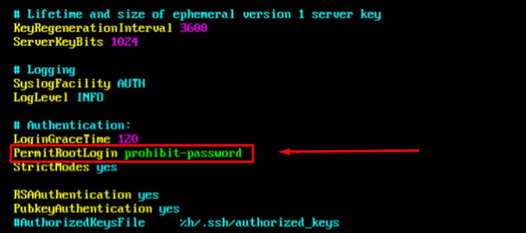
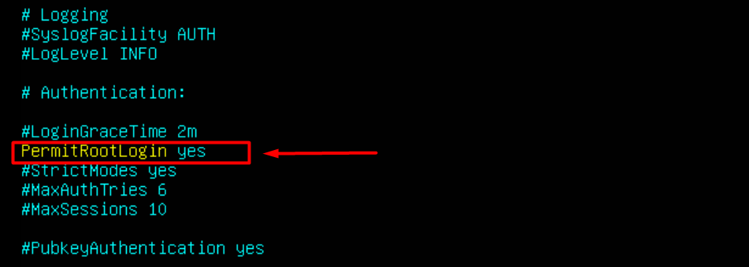

# How to enable root in Ubuntu
1. **Đăng nhập bằng tài khoản user**

2. **Chuyển về quyền đăng nhập bằng tài khoản root**

Gõ lệnh `sudo passwd root` để thay đổi mật khẩu root 

Enter new UNIX password : tạo mật khẩu mới

Retype new UNIX password : nhập lại mật khẩu

passwd: password updated successfully - mật khẩu được cập nhật thành công

Ở đây ta nên tạo một mật khẩu mạnh để đảm bảo tính bảo mật.

Sau khi đã đổi mật khẩu xong gõ lệnh `sudo -i` để đăng nhập bằng tài khoản **root** 

3. **Tiếp theo vào sshd config để cho truy cập ssh bằng tài khoản root**

Nhập lệnh `sudo vi /etc/ssh/sshd_config` để vào file sshd_config

Tìm tới dòng 

**PermitRootLogin prohibit-password**

và chuyển sang **PermitRootLogin yes**

Lưu lại file sshd_config.

Cuối cùng ta restart lại bằng lệnh `systemctl restart ssh`

