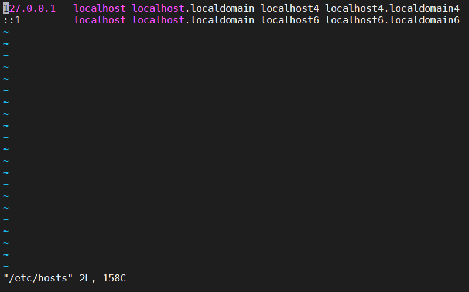
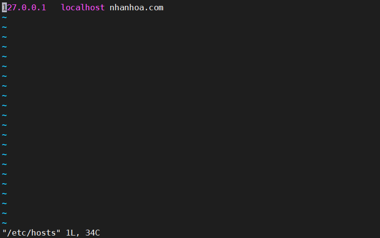
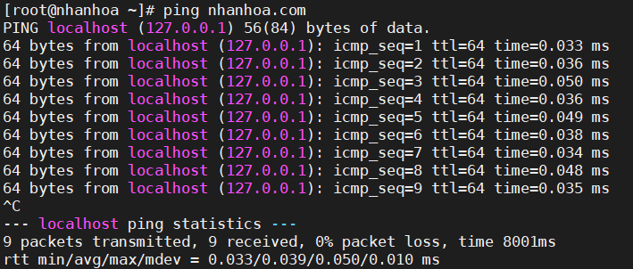

# Thay đổi Hostname

1. **Kiểm tra Hostname**

 Gõ lệnh `Hostnamectl`

2. **Đổi hostname**

`hostnamectl set-hostname <tên hostname cần đổi>`

VD: hostnamectl set-hostname kmasrv

gõ lệnh `bash` khi đã đổi xong hostname để hostname được đổi sang luôn mà không cần phải dùng lệnh `systemcctl restarrt`

3. **Sửa file Hosts**
 
Gõ lệnh `vi /etc/hosts` để vào file và chỉnh sửa

Bấm tổ hợp phím `Shift+a` để di chuyển xuống cuối dòng hoặc bấm `Shift+dấu di chuyển sang ngang` để di chuyển vào những khoảng trống mà ta cần chỉnh sửa.Sau khi chỉnh sửa xong ta có tên miền mới

File sau khi đã sửa xong.

Ping để kiểm tra

Dùng `cat /etc/hosts` để xem file