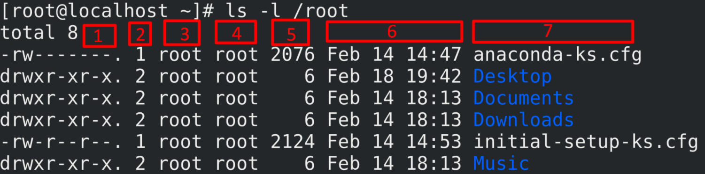

# Các lệnh Linux cơ bản hay sử dụng

1. **`PWD` ( print name of current/woking dierctory)**

*Cho biết thư mục hiện hành đang làm việc 

2. ** `CD` (change dierctory)**

* Dùng để di chuyển vị trí làm việc đến mục khác

 `# cd [path]`

* `cd /etc` - chuyển đến thư mục `etc` 
* `cd usr` - chuyển đến thư mục `usr` 
* `cd ..` - chuyển đến thư mục cha 
* ` cd -` - chuyển đến thư mục vừa mới rời khỏi 
* `cd` - chuyển đến thư mục hiện tại của user
3. **`ls` (list dierctory contents)**
* Dùng để liệt kê nội dung thư mục
`# ls [option] [path]
* Option:
    * `-l` : liệt kê chi tiết 
	* `-a` : liệt kê các file ẩn
	* `-h` : liệt kê file size theo định dạng (KB MB GB)
	* `-S` : liệt kê các file theo thứ tự
	* `-t` : tìm file được chỉnh sửa gần nhất
	* `-R` : liệt kê các file bên trong thư mục
	* `-r` : liệt kê các file theo thứ tự từ dưới lên
    * `*.txt` : liệt kê tất cả các file theo định dạng .txt
* Ý nghĩa các cột kết quả khi thực hiện lệnh `ls -l`:


   |STT|Ý nghĩa|
   |---|:-----:|
   |1| Loại tệp và quyền truy cập     |
   |2| Số lượng liên kết đến tệp      |
   |3| Chủ sở hữu và người tạo ra tệp |
   |4| Nhóm của chủ sở hữu            |
   |5| Kích thước tệp tính bằng byte  |
   |6| Ngày và giờ                    |
   |7| Thư mục hoặc Tên tệp           |
3. **`cp` (copy)**
* Dùng để copy file hay thư mục
`#cp [options] source destination`
* Option
    * `-r, -R` - dùng để copy toàn bộ thư mục

	* `-a` - dùng để copy thư mục nhưng giữ thuộc tính của file	
	* `-v` - hiển thị quá trình copy	
	* `-f` - bắt buộc copy file và ghi đè file trong trường hợp bị trùng tên	
	* `n` - bắt buộc copy và không được ghi đè nếu bị trùng tên
	
* Copy file và đổi tên file 
	
   `cp [tên file] [tên file mới]`
   
* Copy file đến thư mục khác

   `cp [tên file] [đường dẫn file]`
   
VD `cp -r sample.txt /etc/yum`

* Copy file từ thư mục khác đến thư mục hiện hành

   `cp /root/anaconda.cfg .`
   
Note: dấu chấm ở cuối lệnh đại diện cho thư mục mà user đang đứng

4. **`mv (di chuyển)`**

Dùng để di chuyển file và thư mục nhưng cũng có thể đổi tên file

`mv [option] source destination`

* Option:

  `-f` : ghi đè thư mục hay file trong trường hợp bị trùng tên
  
  `-v` : quá trình di chuyển file 
  
* Di chuyển file vào thư mục

   `mv sample.txt /etc`
   
* Di chuyển file vào thư mục và đổi tên 

   `mv sample.txt /etc/sample.doc`
   
* Đổi tên thư mục 

   `mv sample.doc sample.txt`
   
5. **`mkdir` (tạo thư mục)**

Dùng để tạo thư mục

 `mkdir [option] dierctory_name`
 
* Option:

`-p` - tạo thư mục con trong khi chưa tạo thư mục cha

`-v` - hiển thị quá trình tạo thư mục

`-m` - tạo thư mục với phân quyền cụ thể

* Tạo nhiều thư mục cùng 1 lúc
```
 # mkdir muc1 muc2 muc3
  = # mkdir muc{1,2,3}
 ```
 6. `rm` (remove)
 
Dùng để xóa file hay thư mục
 ```
 rm [option] dierctory_name
 ```
   * `-r, -R` - xóa toàn bộ thư mục kể cả thư mục con 
   * `f` - xóa không cần hỏi 
   * `rmdir` - xóa file hay thư mục trống
 7. `touch`
 * Dùng để tạo file trống 
 ```
 # touch <file name>
 ```
 * Tạo nhiều file:
 ```
 # touch file1 file2 file3
 = # touch file{1,2,3}
 = # touch {file1,file2,file3}
 ```
 
 8. **`du` (disk usage)**
 
 * Dùng để xem dung lượng của thư mục
 ```
 du [option] [path]
 ```
 * Option:
     * `-s` : xuất kết quả theo summarize ( tổng dung lượng)
     * `-h` : xuất ra kết quả theo dạng người dùng có thể đọc
     * `-k` : hiển thị thông tin theo dạng kylobyte
     * `-m` : hiển thị thông tin theo dạng mega byte 
 9. ** Các lệnh hệ thống **
 * Tắt hệ thống hoặc khởi động lại.
 ```
 shutdown [options] [time] [wall]
```
   * Options:
       `-h` : shutdown
       `-r` : restart
       `-c` : cancle pending shutdown
   * Time :
       `now`: thực hiện ngay lập tức
       `hh:mm` : ấn định thời gian
	   `+m` : sau m phút sẽ thưc hiện 
   * `wall` : tin nhắn thông báo
   
   VD restart server sau 10p với thông báo "khoi dong lai"
   ```
   shutdown -r +10 "khoi dong lai"
```   


   
   
   
	


