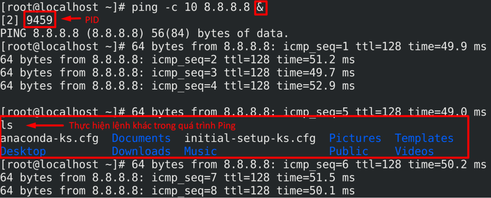
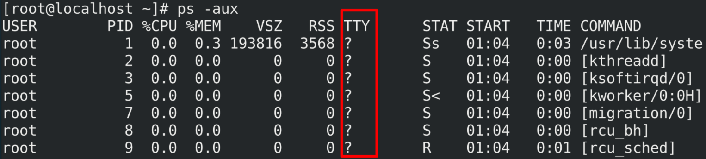

# Process

# Khái niệm

  * Một process ( tiến trình ) hiểu theo cách đơn giản là một ví dụ của một chương trình đang chạy
  * Mỗi process có 1 **PID ( Process ID )** đại diện, **PID** gồm tối đa 5 chữ số và là duy nhất tại 1 thời điểm. **PID** của Process A có thể được tận dụng cho Process B nếu Process A đã kết thúc.
  * Có 2 loại Process: 
      * Foreground Process
	  * Background Process
	  
1. **Foreground process**
   * Theo mặc định mọi process mà bạn bắt đầu chạy bằng Foreground process, nó nhận Input từ bàn phím và gửi Output tới màn hình.
   * Trong khi một chương trình đang chạy trong Foreground và cần một khoảng thời gian dài, chúng ta không thể chạy bất kỳ lệnh khác ( bắt đầu một process khác ) bởi vì dòng nhắc lệnh không có sẵn tới khi chương trình  chạy kết thúc process và thoát ra.


2. **Background Process**
* Background Process chạy mà không được kết nối với bàn phím của bạn. Nếu Background process yêu cầu bất cứ đầu vào từ bàn phím, nó đợi
* Lợi thế của một chương trình chạy trong Background là có thể chạy các lệnh khác: không phải đợi tới khi nó kết thúc để bắt đầu một process mới.
* Để bắt đầu một Background process, thêm dấu `"&"` vào cuối dòng lệnh
```
ping -c 8.8.8.8 &
```

3. **Parent Process (PPID) và Child Process (PID)**
* Mỗi một tiến trình Unix có hai ID được gán cho nó: Process ID (PID) và Parent Process (PPID)
* Mỗi tiến trình trong hệ thống có một Parent Process.

4. **Zombie Process và Orphan Process**
* Thông thường khi một **child process** bị `kill` , **parent process** được thông báo thông qua ký hiệu `SIGCHLD` . Sau đó , **parent process** có thể thực hiện một vài công việc khác hoặc bắt đầu lại **child process** nếu cần thiết.
* Tuy nhiên , đôi khi **parent process** bị `kill` trước khi **child process** của nó bị `kill` . Trong trường hợp này , **parent process** của tất cả các process , **"init process"** , trở thành **PPID** mới . Đôi khi những process này được gọi là **Orphan Process**
* Khi một process bị `kill` , danh sách liệt kê ps có thể vẫn chỉ process với trạng thái `Z` . Đây là trạng thái Zombie, hoặc process không tồn tại . Process này bị `kill` và không được sử dụng. Những process này khác với **orphan process** . Nó là những process mà đã chạy hoàn thành nhưng vần có một cổng vào trong bảng process.

5. **Daemon Process**
* **Daemon** là các **background process** liên quan tới hệ thống mà thường chạy với quyền hạn truy cập của root và các dịch vụ yêu cầu từ process khác.
* Một deamon không có terminal điều khiển . Nó không thể mở `/dev/tty` . Nếu thực hiện lệnh `ps-aux` và quan sát vào trường `tty` , tất cả deamon sẽ có một dấu `?` cho `tty`
* Deamon chỉ là một process mà chạy trong background , thường đợi cho cái gì đó xảy ra mà nó có khả năng làm việc với , giống như máy in deamon đang đợi các lệnh in .

6. **Các lệnh về Process**
   6.1. **`ps` - process status**
	* Dùng để quan sát các process đang chạy.
	* Cấu trúc lệnh:
	```
	ps [options]
	```
	 * Options:
	   * `-f`: hiển thị đầy đủ thông tin về các process
	   * `-e`: hiển thị đầy đủ các process ( bao gồm cả system process )
	   * `aux` = `-ef`: hiển thị đầy đủ thông tin về tất cả các process
	   * `-u`: hiển thị các process liên quan đến user hiện hành
	   * `-p PID`: hiển thị thông tin process cụ thể.
   6.2. **`top`**
    * Nội dung hiển thị tương tự lệnh `ps -aux`
	* Cấu trúc lệnh
	```
	top [options]
	```
	 * Options
	   * `-n number` chỉ định số dòng hiển thị.
	* Gõ `q` để thoát khỏi quá trình `top`
 


   
   
   
	


