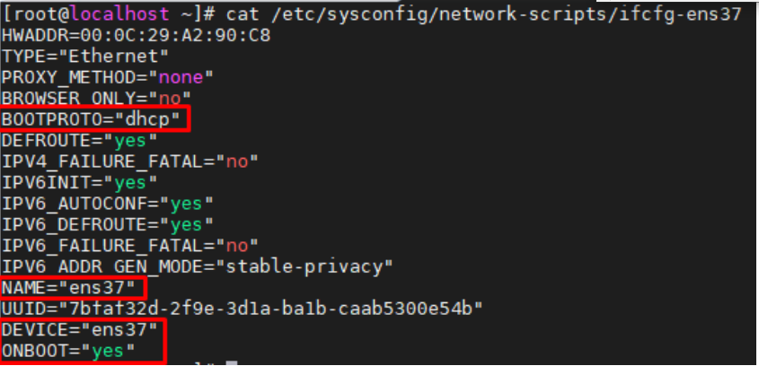

# Cấu hình DHCP Server
### Chuẩn bị
Trên máy server ta sẽ dùng 2 card mạng, 1 card là NAT để ping ra ngoài Internet, card còn lại ta dùng Host-only (VMNet2) để giao tiếp với các máy trong mạng. Trên con client ta dùng card host-ony(VMNet2) để giao tiếp với các máy trong mạng.
### Cấu hình trên Server
1. Đặt địa chỉ IP tĩnh cho server
Kiểm tra trên máy có những interface nào bằng lệnh `nmcli dev status`. Card mạng NAT(ens33) để chế độ cấp IP động do DHCP cấp nên có địa chỉ IP còn card mạng Host-only(ens37) chưa có địa chỉ IP do tắt chế độ cấp phát địa chỉ IP của DHCP. Ta bắt đầu cấu hình đặt địa chỉ IP tĩnh cho card.
```
cd /etc/sysconfig/network-scripts 
cp ifcfg-ens33 ifcfg-ens37 (copy và đổi tên file ens33)
vi ifcfg-ens37 (chỉnh sửa file và đặt địa chỉ IP)
```


2. Cài đặt dhcp trên server

```
yum install -y dhcp
```

3. Cấu hình dhcp server bằng cách chỉnh sửa file `/etc/dhcp/dhcpd.conf`

```
option domain-name "kma.dhcp";
option domain-name-servers server.kma.dhcp;
lease-file-name "/var/lib/dhcpd/dhcpd.leases";
default-lease-time 600;
max-lease-time 7200;

subnet 192.168.40.0 netmask 255.255.255.0 {
  range 192.168.40.50 192.168.40.100;
  option domain-name-servers server.kma.dhcp;
  option domain-name "kma.dhcp";
  option routers 192.168.40.1;
  option broadcast-address 192.168.40.255;
  default-lease-time 600;
  max-lease-time 7200;
}
```
Ở đây:
* Cấu hình toàn cục (global) cho DHCP server
  * option domain-name: khai báo tên miền lớp mạng chung.
  * option domain-name-servers: khai báo tên server của domain bạn đã cung cấp ở trên.
  * lease-file-name: chỉ định file chứa thông tin IP đã được cấp phát qua DHCP.
  * default-lease-time: thời gian tồn tại mặc định của IP DHCP cấp phát cho người dùng
  * max-lease-time: thời gian tồn tại tối đa mà địa chỉ IP DHCP cấp phát cho người dùng.
* Cấu hình cục bộ (local) cho DHCP server
  * range <ip_1> <ip_2>: dải ip mà máy chủ cấp phát động
  * option domain-name-servers: cung cấp thông tin DNS của server cho client.
  * option domain-name: tên miền của server
  * option routers: thông tin địa chỉ IP của router gateway mà client sẽ sử dụng khi nhận IP DHCP.
  * option broadcast-address: thông tin broadcast của lớp mạng mà client sẽ nhận IP sử dụng.

Sau khi sửa file ta khởi động lại bằng lệnh `systemctl restart dhcp`

4. Khởi động DHCP server và set rule firewall

* Bây giờ ta sẽ khởi động lại dịch vụ dhcp trên server
```
systemctl start dhcp
```
Nếu đang chạy firewall, hãy cho phép dịch vụ DHCP. DHCP server sử dụng port 67/UDP.
```
firewall-cmd --add-service=dhcp --permanent
firewall-cmd --reload
```
Kiểm tra trạng thái dịch vụ `systemctl status dhcp`

5. Cấu hình dhcp trên client
5.1 Trên Client Centos

Cài đặt interface mạng nhận dhcp của server:


Sau đó khởi động lại dịch vụ mạng
```
systemctl restart network
```
Kiểm tra ip lại bằng lệnh `ip add`


